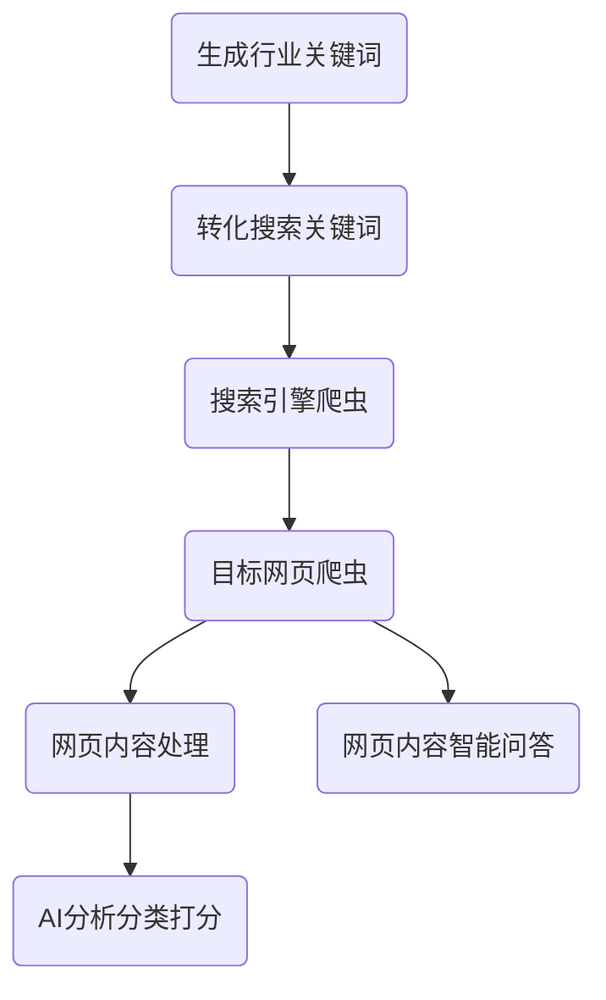

# 《基于语言模型的行业信息获取系统：设计与实现》
## GitHub 链接
GitHub: [Awakcn/Industry-Information-Scraper](https://github.com/Awakcn/Industry-Information-Scraper/blob/main/industry_information_scraper_240913.ipynb) 更新日期：2024/9/13

新增向量评分方案（余弦相似度），优化问答机器人（回答参考网页号输出）等
## 1. 引言
### 1.1 研究背景
随着信息技术的快速发展，数据量呈现指数级增长，如何从大量数据中快速、精准地获取有效信息成为了关注的焦点。传统的信息检索系统依赖于关键词匹配，用户需要具备较高的专业知识来构建精确的查询表达式。这种模式在面对复杂的自然语言问题时，表现出一定的局限性。

近年来，基于深度学习的语言模型（如GPT等）在自然语言处理（NLP）领域取得了巨大突破。语言模型能够理解上下文语境，生成自然的语言文本，极大地提高了信息提取和内容生成的能力。通过引入基于语言模型的信息获取系统，用户可以更自然地与系统进行交互，简化信息检索过程，提高获取信息的准确度和效率。

### 1.2 研究意义
传统的信息检索系统大多基于布尔逻辑或向量空间模型，它们在面对大量结构化或非结构化数据时，存在难以处理模糊查询和复杂语义的问题。此外，随着用户需求的多样化，信息检索系统需要处理多种数据格式，传统方法往往无法有效应对这些复杂的需求。

相比之下，基于语言模型的系统能够通过理解用户输入的自然语言，进行语义层面的分析和匹配，进而提供更智能化的检索体验。这不仅减少了用户学习查询语言的负担，还能提高信息获取的精度和响应速度。因此，基于语言模型的信息获取系统在现代信息服务领域具有广泛的应用前景。

## 2. 技术架构
### 2.1 组件描述
- 用户界面（UI）：基于 Gradio 提供的前端界面，用于用户输入和展示结果。
- 后端服务：处理业务逻辑、数据处理和与外部服务的交互。
  - 关键词生成：通过 OpenAI 的语言模型生成与行业相关的关键词。
  - 网页抓取：从搜索引擎获取与关键词相关的网页链接。
  - 网页内容处理：清理和提取网页文本内容，去除广告和无关信息。
  - 网页分析：使用语言模型对网页内容进行分析，评分并生成报告。
### 2.2 技术栈
- 编程语言
	- Python：主要编程语言，用于实现系统的各个功能模块。
- 部分框架与库
	- Gradio：构建用户界面的工具，提供交互式的网页应用。
	- LangChain：用于处理语言模型的框架，简化了与 OpenAI 模型的交互。

	- Requests：处理 HTTP 请求，用于从搜索引擎获取网页内容。
	- BeautifulSoup：解析和清理 HTML 内容，从网页中提取有用的文本。
	- Fake_UserAgent：生成随机的用户代理，以避免被网站屏蔽。
	- Chardet：检测网页内容的编码格式，确保正确解析。
	- FAISS：高效的相似度搜索库，用于对网页内容进行向量化和搜索。
- API 与服务
	- OpenAI API：用于语言模型的调用，支持关键词生成和网页内容分析。
	- 搜索引擎：用于获取与关键词相关的网页链接（示例中使用百度）。

### 2.3 功能设计

### 2.4 模块的导入
```python
import gradio as gr
from langchain_openai import ChatOpenAI
from langchain_core.prompts import ChatPromptTemplate
from langchain_core.output_parsers import StrOutputParser
import re
import requests
from bs4 import BeautifulSoup
from fake_useragent import UserAgent
import random
from time import sleep
import re
import chardet

from langchain_openai import embeddings
from langchain.vectorstores import FAISS
from langchain.text_splitter import RecursiveCharacterTextSplitter
```

## 3. 关键词生成与处理模块
### 3.1 关键词生成
- 输入：
  - 用户输入: 行业名称。
- 实现细节：
  - 使用的工具：ChatOpenAI 和 ChatPromptTemplate。
  - 使用的模型：Qwen/Qwen2-7B-Instruct-GGUF - LM Studio - 本地大模型
- 生成方法：
  - 通过定义的提示模板生成与行业相关的关键词。
- 关键参数：
  - max_tokens：生成的最大字数。
  - temperature 和 top_p：控制生成内容的多样性和创造性。
- 输出：
  - 流式输出生成的关键词文本。

```python
def generate_keywords(input):
    llm = ChatOpenAI(base_url="http://localhost:1234/v1", api_key="lm-studio", max_tokens=1280, temperature=0.7, top_p=0.9)
    prompt = ChatPromptTemplate.from_messages([("user", 
'''
请你扮演一名专业的行业分析师，你应该利用你的行业知识和其他相关因素提供专业的分析。

请你给出以下行业以下每个主题各3至5个重要关键词，关键词应包括行业术语、概念或趋势，保证关键词的准确、精炼性和与主题的相关度，逻辑连贯，内容低重复度、有深度。禁止使用"："和"（）"，避免使用品牌名称或专用词，关键词要易搜索和理解。
行业：{input}

主题：
1. 行业定义
2. 行业分类
3. 行业特征
4. 发展历程
5. 产业链分析
6. 市场规模
7. 政策分析
8. 竞争格局

使用以下格式：
1. <主题1>
- <关键词1>
- <关键词2>
- <关键词3>
- <关键词4>
- <关键词5>

2. <主题2>
- <关键词1>
..
..
8. ..
完成上述任务后，请停止生成任何额外内容。

样例：
1. 行业定义
- 水域资源管理
- 养殖技术进步
- 水产品质量监控
- 海洋生态环境保护
- 农水联动模式

2. 行业分类
- 鱼类养殖
- 虾蟹养殖
- 牛蛙业
- 海参养殖
- 浮游生物养殖

3. 行业特征
- 规模化生产
- 生物多样性
- 投入成本
- 市场周期性
- 环保压力

4. 发展历程
- 人工饲料
- 智能水产养殖
- 全球化市场拓展
- 产业链整合
- 技术驱动革新

5. 产业链分析
- 种苗供应
- 饲料加工
- 养殖基地建设
- 销售和分销

6. 市场规模
- 全球水产养殖产量
- 主要消费国
- 国内市场规模
- 年度报告与预测

7. 政策分析
- 环保政策影响
- 信贷和补贴支持
- 农业补贴调整

8. 竞争格局
- 主要企业竞争态势
- 新进入者威胁
- 品牌差异化策略
- 外资并购与合作
''')])

    str_output_parser = StrOutputParser()
    chain = prompt | llm | str_output_parser

    accumulated_text = ""
    for message in chain.stream({"input": input}):
        accumulated_text += message
        yield accumulated_text
```

### 3.2 关键词处理
- 输入:
生成的关键词: 从“关键词生成”模块获得的文本。
- 处理步骤:
分行处理: 通过换行符分隔每个关键词。
主题分类: 根据文本中的标记识别和分类行业定义和关键词。
- 实现细节:
正则表达式: 使用正则表达式提取行业定义和关键词。
数据结构: 使用字典和列表来存储和处理关键词数据。
- 输出:
处理后的关键词: 分类后的关键词列表。
关键词选项: 为进一步操作生成的关键词选择。

```python
def process_keywords(input):
    lines = input.strip().split("\n")
    industry_keywords = []
    current_topic = ""
    topics = {}
    keywords = []
    for line in lines:
        if re.match(r".*?\d+\.\s.*", line):  	# 1. 行业定义
            current_topic = line.split(". ")[1].strip()
            topics[current_topic] = []
        elif re.match(r".*?-\s.*", line):      	# - 行业关键词
            keyword = line.split("- ")[1].strip()
            topics[current_topic].append(keyword)
            industry_keywords.append((current_topic, keyword))
            keywords.append(keyword)

    accumulated_text = ""
    for topic, keyword in industry_keywords:
        accumulated_text += f"{keyword}\n"

    return accumulated_text, keywords_to_option(input)
    
def keywords_to_option(input):
    lines = input.strip().split("\n")
    industry_keywords = []
    current_topic = ""
    topics = {}
    keywords = []
    for line in lines:
        if re.match(r".*?\d+\.\s.*", line):  	# 1. 行业定义
            current_topic = line.split(". ")[1].strip()
            topics[current_topic] = []
        elif re.match(r".*?-\s.*", line):      	# - 行业关键词
            keyword = line.split("- ")[1].strip()
            topics[current_topic].append(keyword)
            industry_keywords.append((current_topic, keyword))
            keywords.append(keyword)

    return gr.update(choices=keywords, value=None, interactive=True)
```

### 3.4 用户界面与示例
- 输入组件: 行业名称的输入框。
- 按钮功能:
  - 生成关键词按钮: 调用关键词生成函数。
  - 处理关键词按钮: 调用关键词处理函数。
  - 清除关键词按钮: 清空所有相关文本框和选择项。
- 输出组件:
  - 关键词生成文本框: 显示生成的关键词。
  - 处理后的关键词文本框: 显示处理后的关键词
  - 处理后的关键词选项: 显示处理后的关键词选项


## 4. 网页抓取与处理模块
### 4.1 网页链接抓取
- 功能概述：讲解模块如何从网络上抓取网页内容。
- 核心函数：
handle_selection()
  - 功能：从百度搜索结果中提取网页链接。
  - 参数：
industry: 行业名称
keywords_to_search: 搜索关键词
pages_needed: 需要的页面数量
- 实现步骤：
  - 设置请求头（使用 UserAgent 伪装成浏览器）
  - 发送 HTTP 请求并解析响应
  - 提取网页链接
- 异常处理：通过 retry_function() 进行重试，处理网络请求中的异常情况。
  - 功能：重试请求以处理临时故障
  - 参数：
fn: 要重试的函数
max_retries: 最大重试次数
delay: 延迟时间

```python
def handle_selection(industry, keywords_to_search, pages_needed):
    # 模拟处理函数，可能抛出异常
    if industry == "" or keywords_to_search == "":
        return "请输入行业和关键词"
    ua = UserAgent()
    headers = {
        'accept': '*/*',
        'accept-encoding': 'gzip, deflate, br, zstd',
        'accept-language': 'zh-CN,zh;q=0.9,en;q=0.8,en-GB;q=0.7,en-US;q=0.6',
        'connection': 'keep-alive',
        'User-Agent': ua.edge
    }
    all_links = []
    keyword_combination = f"{industry} {keywords_to_search}"
    for pages in range(pages_needed):
        page = pages * 10
        response = requests.get(f'https://www.baidu.com/s?wd={keyword_combination}&pn={page}', headers=headers)

        html = response.text
        soup = BeautifulSoup(html, 'html.parser')

        content_left = soup.find('div', attrs={'id': 'content_left'})
        all_divs = content_left.find_all('div', attrs={'mu': True})
        links = [div.get('mu') for div in all_divs]
        all_links.extend(links)

    results = "\n".join([f"{i+1}. {link}" for i, link in enumerate(all_links)])
    return results

def retry_function(fn, max_retries, delay, industry, keywords_to_search, pages_needed):
    for attempt in range(max_retries):
        try:
            result = fn(industry, keywords_to_search, pages_needed)
            return result
        except Exception as e:
            if attempt < max_retries - 1:
                random_delay = random.uniform(delay-0.5, delay+0.5)
                sleep(random_delay)  # 延迟重试
            else:
                return f"Error: {str(e)}"

def selection_to_links(industry, keywords_to_search, pages_needed):
    return retry_function(handle_selection, max_retries=5, delay=1.5, industry=industry, keywords_to_search=keywords_to_search, pages_needed=pages_needed)
```

### 4.2 网页内容处理
- 功能概述：描述如何处理抓取的网页内容，以去除广告、提取纯文本等。
- 核心函数：
  - clean_html()
    - 功能：将 HTML 内容转换为清晰的文本。
    - 实现步骤：
解析 HTML
移除广告内容、脚本和样式
插入换行符，清理多余空格
  - remove_ads_by_tag()
    - 功能：根据 HTML 标签移除广告内容。
    - 实现步骤：
定义常见的广告类名和 ID
使用 BeautifulSoup 查找并删除这些标签
  - remove_ads_by_text()
    - 功能：根据文本内容移除广告。
    - 实现步骤：
定义广告关键词
使用 BeautifulSoup 查找并删除包含这些关键词的文本
```python
def remove_ads_by_tag(soup):
    # 常见的广告类名或ID
    tag_keywords = ['next', 'post_top_tie', 'jubao', 'search', 'comment_area', 'share', 'nav', 'ad', 'recommend', 'tool', 'advertisement', 'ads', 'sponsored', 'promo', 'banner', 'adsense', 'aside', 'footer', 'header', 'side-bar', 'column', 'sidebar', 'list', 'sideColumn', 'side']

    pattern = re.compile('|'.join(tag_keywords), re.IGNORECASE)

    tags = soup.find_all(class_=pattern)
    for tag in tags:
        tag.decompose()

    tags = soup.find_all(id=pattern)
    for tag in tags:
        tag.decompose()
    # 删除头尾侧边栏
    for iframe in soup.find_all('iframe'):
        iframe.decompose()
    for aside in soup.find_all('aside'):
        aside.decompose()
    for header in soup.find_all('header'):
        header.decompose()
    for footer in soup.find_all('footer'):
        footer.decompose()

    return soup

def remove_ads_by_text(soup):
    ad_keywords = ['优惠券', '阅读原文', '扫一扫', '限时抢购', '免费试用', '立即注册', '超值折扣', '注册有礼', '免费领取', '立即购买', '关注该公众号', '微信扫码', '分享至', '下载(.*?)客户端', '返回(.*?)首页', '阅读下一篇', '特别声明：以上内容', 'Notice: The content above', '打开(.*?)体验更佳', '热搜', '打开(.*?)新闻', '查看精彩图片']
    for keyword in ad_keywords:
        for ad in soup.find_all(string=re.compile(keyword)):
            parent = ad.find_parent()
            if parent:
                parent.decompose()

    return soup

def clean_html(html_content):
    # 使用BeautifulSoup解析HTML
    soup = BeautifulSoup(html_content, 'lxml')
    soup = remove_ads_by_tag(soup)
    soup = remove_ads_by_text(soup)
    # 去除脚本和样式
    for script in soup(['script', 'style']):
        script.decompose()
    # 插入换行符
    for tag in soup.find_all(['p', 'h1', 'h2', 'h3', 'h4', 'h5', 'h6', 'li', 'tr', 'div', 'br', 'hr']):
        tag.insert_after('\n')
    # 提取文本
    text = soup.get_text()
    # 正则表达式清理多余空格空行
    text = re.sub(r'\n+', '\n', text)
    text = re.sub(r'\s{2,}', ' ', text)

    return text
```

### 4.3 从链接提取文本
- 核心函数：
webpage_to_text()
  - 功能：从多个网页链接中提取文本内容。
  - 参数：
links_found: 从搜索中获得的链接
min_slider: 页码范围最小值
max_slider: 页码范围最大值
num: 指定的页面范围
  - 实现步骤：
遍历网页链接并发送 HTTP 请求
处理响应内容并应用 clean_html()
提取和整合文本

```python
def webpage_to_text(links_found, min_slider, max_slider, num):
    all_links = [line.split('. ', 1)[1] for line in links_found.splitlines()]
    accumulated_text = ""

    minnum = int(min_slider)
    maxnum = int(max_slider)

    # 使用正则表达式解析 num
    num_pattern = r'^(\d+)(?:-(\d+))?$'  # 匹配单个数字或范围
    match = re.match(num_pattern, num)
    if match:
        start_num = int(match.group(1))
        end_num = int(match.group(2)) if match.group(2) else start_num
        minnum = start_num if start_num > 0 else minnum
        maxnum = end_num


    if maxnum == 0 or maxnum < minnum:
        maxnum = minnum

    if minnum == 0 or all_links == []:
        accumulated_text += "请选择链接"
        return accumulated_text
    
    ua = UserAgent()
    headers = {
        'accept': '*/*',
        'accept-encoding': 'gzip, deflate, br, zstd',
        'accept-language': 'zh-CN,zh;q=0.9,en;q=0.8,en-GB;q=0.7,en-US;q=0.6',
        'connection': 'keep-alive',
        'User-Agent': ua.edge
    }
    count = int(0)
    for link in all_links:
        count += 1
        if count < minnum or count > maxnum:
            continue
        accumulated_text += f"第{count}个网页：\n{link}\n"
        if re.findall(r'zhihu', link):
            accumulated_text += "Error: Zhihu\n"
            continue
        if re.findall(r'weibo', link):
            accumulated_text += "Error: Sina Visitor System\n"
            continue
        try:
            # 获取html的文本内容
            response = requests.get(link, headers=headers)

            response.raise_for_status()  # 检查请求是否成功

            # 检测编码
            encoding_result = chardet.detect(response.content)
            encoding = encoding_result['encoding']
            response.encoding = encoding
            if re.findall(r'weixin', link):
                response.encoding = 'utf-8'
                
            # 获取网页标题
            soup = BeautifulSoup(response.text, 'html.parser')
            if soup.title and soup.title.string:
                title = soup.title.string
                if title == "百度安全验证":
                    accumulated_text += "Error: Baidu Security Verification\n"
                    continue
                if re.findall(r'百度文库', title):
                    accumulated_text += "Error: Baidu Wenku\n"
                    continue
                # accumulated_text += f"{title}\n" #不显示标题，会重复

            text = clean_html(response.text)
            accumulated_text += f"{text}\n\n"

        except requests.exceptions.RequestException as e:
            accumulated_text += f"Failed to retrieve {link}: {e}\n"
    
    return accumulated_text, minnum, maxnum
```

### 4.4 页面号解析与分析
- 核心函数：
  - parse_pages()
    - 功能：解析用户输入的页面号或范围。
    - 实现步骤：
      - 替换分隔符
      - 拆分字符串并生成页面号列表
  - analyze_webpage()
    - 功能：分析单个网页内容的完整性、总结网络内容并对网页进行评分。
    - 参数：
      - webpage_text: 网页内容
      - keywords_processed: 处理后的关键词
      - webpage_to_analyze: 要分析的网页编号
      - industry: 行业名称
      - keywords_to_search: 搜索关键词
    - 实现步骤：
      - 从网页内容中提取相关部分
      - 使用模型检查文章完整性
      - 计算和返回评分
  - batch_analyze_webpage()
    - 功能：批量分析网页内容。
    - 参数：
      - analyze_all: 是否分析所有页面
      - webpage_text: 网页内容
      - keywords_processed: 处理后的关键词
      - webpage_to_analyze: 要分析的网页编号
      - industry: 行业名称
      - keywords_to_search: 搜索关键词
      - minnum: 最小页码
      - maxnum: 最大页码
    - 实现步骤：
      - 解析页面号
      - 遍历并分析每个网页
```python
def parse_pages(pages_str, minnum, maxnum):
    # 替换分隔符
    pages_str = re.sub(r'[;\/.，。、]', ',', pages_str)
    # 拆分字符串
    parts = pages_str.replace(' ','').split(',')
    
    result = []
    for part in parts:
        # 单个数字
        if '-' not in part:
            num = int(part)
            if minnum <= num <= maxnum:
                result.append(num)
        else: # 数字范围
            start, end = map(int, part.split('-'))
            result.extend([num for num in range(start, end + 1) if minnum <= num <= maxnum])
    
    return result

def calculate_final_score(relevance, accuracy, completeness, timeliness, authority, readability):
    # 定义每个维度的权重
    weights = {
        'relevance': 0.25,
        'accuracy': 0.20,
        'completeness': 0.15,
        'timeliness': 0.15,
        'authority': 0.15,
        'readability': 0.10
    }
    # 计算加权总分
    final_score = (
        relevance * weights['relevance'] +
        accuracy * weights['accuracy'] +
        completeness * weights['completeness'] +
        timeliness * weights['timeliness'] +
        authority * weights['authority'] +
        readability * weights['readability']
    )
    
    return final_score

def batch_analyze_webpage(analyze_all, webpage_text, keywords_processed, webpage_to_analyze, industry, keywords_to_search, minnum, maxnum):
    if webpage_to_analyze:
        pages_to_analyze = parse_pages(webpage_to_analyze, minnum, maxnum)
    if analyze_all == True: # 优先选择全部
        pages_to_analyze = range(minnum, maxnum + 1)
    
    analyzed_webpage = str("")
    for i in pages_to_analyze:
        analyzed_webpage += f"正在分析第{i}个网页：\n"
        yield analyzed_webpage
        for part in analyze_webpage(webpage_text, keywords_processed, i, industry, keywords_to_search):
            yield analyzed_webpage + part
        # analyzed_webpage += analyze_webpage(webpage_text, keywords_processed, i, industry, keywords_to_search)
        analyzed_webpage += part

def analyze_webpage(webpage_text, keywords_processed, webpage_to_analyze, industry, keywords_to_search):
    accumulated_text = ""
    llm = ChatOpenAI(base_url="http://localhost:1234/v1", api_key="lm-studio", max_tokens=512, temperature=0.6, top_p=0.8, stop_sequences=["---END---"])
    n = webpage_to_analyze  # 要提取的页面编号
    weblink = re.search(rf'第{n}个网页：\n(https?:\/\/[^\s]+)', webpage_text)
    pattern = rf'第{n}个网页：\n(?:https?:\/\/[^\n]*\n)?([\s\S]*?)(?=\n第\d+个网页：|\Z)'
    match = re.search(pattern, webpage_text)
    if match:
        content = match.group(1).strip()  # 提取并去除首尾空格
    
        prompt0 = ChatPromptTemplate.from_messages([("user", 
'''
请判断以下网页爬虫获取的、与{input}行业以及{keywords_to_search}相关的文章页面是否存在缺失（只有标题、没有正文、字数过少、少于100字等）或报错（Error、Failed、错误、验证码等）。请忽略页面中的可能出现的广告、推荐、导航栏等无关信息。
文章：
{text}

若存在缺失或报错，则直接输出"Error---END---"；文章完整，则直接输出"Complete---END---"。
''')])
        chain0 = prompt0 | llm | StrOutputParser()
        reply0 = chain0.invoke({"input": industry, "text": content, "keywords_to_search": keywords_to_search})

        if re.search(r'Error', reply0, re.IGNORECASE):
            reply0 = chain0.invoke({"input": industry, "text": content, "keywords_to_search": keywords_to_search})
            if re.search(r'Error', reply0, re.IGNORECASE):
                iscomplete = False
            else:
                iscomplete = True
            iscomplete = False
        else:
            iscomplete = True
        if not iscomplete:
            accumulated_text += f"网址：{weblink[1]}\n\n文章内容缺失。\n\n综合评分：0/100\n----------\n\n"
            yield accumulated_text
            return

        prompt = ChatPromptTemplate.from_messages([("user", 
'''
#START#-#END#为输出格式的范围，[]内为需要填写的部分。

第一步：请阅读以下与{input}行业及{keywords_to_search}的文章，并根据文章内容写一个自然段的简介，字数不超过300字。请忽略文章中的广告、推荐和导航栏等无关信息。

文章：
{text}

输出格式：#START#
标题：[此处填写标题]
简介：
[此处撰写简介（字数不超过300字）]
#END#

第二步：根据文章内容，提取与{input}行业以及{keywords_to_search}相关的**至多8个**关键词。

可参考的关键词：（
{keywords}）

输出格式：#START#
关键词：[关键词1]；[关键词2]；...；[关键词n（关键词最多8个）]
#END#

第三步：请对文章与{input}行业及{keywords_to_search}的相关性等各维度进行评分，范围是0到100，现在是2024年。

评分标准：尽量不给90-100，优秀文章给70-89，普通文章给50-69，质量较差给30-49

请按以下格式输出：#START#
相关性：[n]/100
准确性：[n]/100
完整性：[n]/100
时效性：[n]/100
权威性：[n]/100
可读性：[n]/100
---END---
#END#
---END---
''')])

        chain = prompt | llm | StrOutputParser()

        accumulated_text += f"网址：{weblink[1]}\n"
        yield accumulated_text
        for message in chain.stream({"input": industry, "text": content, "keywords": keywords_processed, "keywords_to_search": keywords_to_search}):
            accumulated_text += message
            accumulated_text = accumulated_text.replace("---END---", "").replace("#START#", "").replace("#END#", "")
            yield accumulated_text

        # 匹配分数
        pattern = r"(?P<dimension>[\u4e00-\u9fa5]+)：(?P<score>\d+)/100"
        matches = re.findall(pattern, accumulated_text)
        scores = {dimension: int(score) for dimension, score in matches}
        if scores.get("综合评分", 60) == 0:
            final_score = 0
        else:
            final_score = calculate_final_score(scores.get("相关性", 0), scores.get("准确性", 0), scores.get("完整性", 0), scores.get("时效性", 0), scores.get("权威性", 0), scores.get("可读性", 0))
            accumulated_text += f"综合评分：{round(final_score, 2)}/100\n"
            accumulated_text += "----------\n\n"
        accumulated_text = re.sub(r'\n{3,}', '\n\n', accumulated_text)
        yield accumulated_text

        # return reply #, match_keywords(reply)
    else:
        accumulated_text += f"未找到第{n}个页面的内容"
        yield accumulated_text #, gr.update(choices=["Error"], value=None, interactive=False)
```

### 4.5 结果排序
- 核心函数：
sort_results()
  - 功能：根据综合评分对分析结果进行排序。
  - 参数：
text: 待排序的分析结果
- 实现步骤：
  - 提取上一步大模型生成的综合评分
  - 按评分排序
```python
def sort_results(text):
    pattern = r"正在分析第(\d+)个网页：\n网址：\s*(.*?)综合评分：(?P<score>\d+(\.\d{1,2})?)/100"
    # 使用 findall 查找所有匹配项
    matches = re.findall(pattern, text, re.DOTALL)
    # 提取网页编号、内容和对应的综合评分
    results = []
    for match in matches:
        webpage_number = match[0]
        webpage_content = match[1].strip()
        score = float(match[2])
        results.append((webpage_number, webpage_content, score))
    # 按照综合评分排序，分数高的排在前面
    sorted_results = sorted(results, key=lambda x: x[2], reverse=True)
    # 输出排序后的结果
    final_results = ""
    for result in sorted_results:
        final_results += f"第{result[0]}个网页：\n{result[1]}\n\n综合评分：{result[2]}/100\n----------\n\n"
    return final_results
```

### 4.6 用户界面与示例


### 4.7 新增余弦相似度
使用向量方法判断搜索结果文章与关键词的关联性
参数     | 作用
-------- | -----
text1, text2  | 主题与搜索结果文章
min_length  | 最小分段长度
split_char  | 分段符号

向量方法评分函数
```python
def calculate_by_vector(text1, text2, min_length=20, split_char=r'[|\n]'):
    # 初始化嵌入模型
    embedding = embeddings.OpenAIEmbeddings(check_embedding_ctx_length=False, base_url="http://localhost:1234/v1", api_key="lm-studio")
    # 将文本转换为向量
    vector1 = embedding.embed_query(text1)
    # 分段
    segments = re.split(split_char, text2)
    # 设定最小长度限制，过滤掉短句
    filtered_segments = [segment.strip() for segment in segments if len(segment.strip()) >= min_length]
    # 计算每个段落与主题的相似度
    similarities = []
    for segment in filtered_segments:
        vector2 = embedding.embed_query(segment)
        similarity = cosine_similarity([vector1], [vector2])
        similarities.append((segment, similarity[0][0]))
    # 找到相似度最高的段落
    if similarities:
        best_segment, best_similarity = max(similarities, key=lambda x: x[1])
    else:
        best_segment, best_similarity = '', 0.00
    return best_similarity, best_segment
```
主处理函数中新增语句
```python
# 设定搜索关键词等参数
cosine_similarity = calculate_by_vector(industry + ' ' + keywords_to_search, content, 20, r'[|\n]')[0]
# 格式化输出
accumulated_text += f"向量评分：{cosine_similarity*100:.0f}/100（最高余弦相似度）\n"
```

## 5. 问答模块
在行业信息获取器中，问答模块是一个关键部分，它允许用户通过自然语言查询与网页内容相关的信息，并得到相应的回答。以下是该模块的详细设计和功能描述：

### 5.1 功能概述
问答模块通过与大语言模型（LLM）的交互，为用户提供基于网页内容的回答。用户可以输入问题，系统会根据网页内容和相关信息生成回答。

### 5.2 输入组件
用户消息（Textbox）：
- 允许用户输入问题。
- 提供用户界面以提交问题进行查询。
- 网页内容（Textbox）：

存储从网页获取的内容，用于回答用户的问题。
该内容会被分割成多个文本块，并存储于向量数据库中。
### 5.3 模型交互
- 初始化模型：

  - 使用 ChatOpenAI 和 OpenAIEmbeddings 对网页内容进行处理。
  - 创建一个 FAISS 向量存储，从中可以进行相似度搜索。
- 文本块分割：
  - 使用 RecursiveCharacterTextSplitter 对网页内容进行分块处理，以便高效地进行相似度搜索。
- 向量化：
  - 将分块后的文本转换为向量，以便在向量数据库中进行相似度搜索。
- 问答生成：
  - 根据用户输入的问题和网页内容生成回答。
  - 使用模板将网页内容与问题结合，指导模型生成回答。
### 5.4 处理流程
- 处理用户输入：
  - 用户在文本框中输入问题，并提交查询请求。
  - 系统将问题与网页内容结合进行处理。
- 相似度搜索：
  - 通过向量化的文本块进行相似度搜索，找到与用户问题最相关的文本块。
- 生成回答：
  - 根据相关文本块和用户问题生成回答。
  - 使用预定义的模板来格式化回答内容，包括文本块编号和相关信息来源。
- 返回结果：
  - 将生成的回答显示在用户界面上，并更新问答记录。

### 5.5 代码实现
```python
# 问答函数
def chatbot_response(message, chat_history, webpage_text):
    # 添加用户的消息到历史记录
    chat_history.append(("用户", message))
    
    accumulated_text = ""

    llm = ChatOpenAI(base_url="http://localhost:1234/v1", api_key="lm-studio", stop_sequences=["### Response", "<|endoftext|>", "###", "---"])
    embedding = embeddings.OpenAIEmbeddings(check_embedding_ctx_length=False, base_url="http://localhost:1234/v1", api_key="lm-studio")

    text_splitter = RecursiveCharacterTextSplitter(chunk_size=600, chunk_overlap=100)
    texts = text_splitter.split_text(webpage_text)
    # 向量化
    vectorstore = FAISS.from_texts(texts, embedding)

    template ="""{context}
1. 仅根据以上给出的信息回答问题，不要使用自身的知识。
2. 指明回答参考的文本块号。
问题: {question}

回答示例（问题：小家电的种类）：
回答：按照小家电的使用功能，可以将其分为四类：是厨房小家电产品、家居小家电产品、个人生活小家电产品、个人使用数码产品
来源：第3个文本块、第4个文本块
"""
    prompt = ChatPromptTemplate.from_template(template)

    query = message
    docs = vectorstore.similarity_search(query)

    def format_docs(docs):
        return "\n\n".join(f"第{index}个文本块：\n"+doc.page_content for index, doc in enumerate(docs, start=1))

    formated_docs = format_docs(docs)

    chain = (
        prompt
        | llm
        | StrOutputParser()
    )

    answer = chain.invoke({"context": formated_docs, "question": query})
    accumulated_text += (answer+"\n")

    pattern = r'第(\d+)个文本块'
    matches = re.findall(pattern, answer)
    unique_list = list(set(matches)) # 去重

    for match in unique_list:
        accumulated_text += (f'第{match}个文本块')
        # 查找网页
        article = webpage_text
        target_sentence = docs[int(match)-1].page_content
        header_pattern = r'第\d+个网页'
        paragraph_pattern = re.compile(rf'({header_pattern})(.*?)(?={header_pattern}|$)', re.DOTALL)
        paragraphs = paragraph_pattern.findall(article)
        for header, content in paragraphs:
            if target_sentence in content:
                accumulated_text += f"来源于：{header}\n"
                break
        else:
            accumulated_text += "来源于：未知"

        response = accumulated_text
    
    # 将模型的回复添加到历史记录
    chat_history.append(("回答", response))
    
    return chat_history, ""
```
### 5.6 用户界面与示例


## 6. 简易用户界面构建
使用 Gradio 库构建一个用户界面，处理关键词生成、网页抓取与内容分析等任务。
### 6.1 基本布局
```python
with gr.Blocks() as demo:
```
这是 Gradio 中构建 UI 的基础框架。gr.Blocks 是用于组织和布局 UI 元素的容器。

### 6.2 标题和描述
```python
    title = gr.Markdown("## 行业信息获取器")
    description = gr.Markdown("输入行业，生成相关关键词。")
```
这部分用于显示页面的标题和简短描述，帮助用户理解页面的功能。

### 6.3 输入与输出部分
```python
    with gr.Row():
        industry = gr.Textbox(label="输入行业名", lines=1, max_lines=1)
        keywords_generated = gr.Textbox(label="行业关键词", lines=8, max_lines=8, show_copy_button=True)
        keywords_processed = gr.Textbox(label="处理后的关键词", lines=8, max_lines=8, show_copy_button=True)
```
输入行业名：用户在此输入希望查询的行业名。
行业关键词：生成的关键词显示在这个文本框中，支持一键复制。
处理后的关键词：经过处理后的关键词显示在这个文本框中。
### 6.4 按钮和交互
```python
    with gr.Row():
        generate_button = gr.Button("生成关键词")
        generate_button.click(fn=generate_keywords, inputs=industry, outputs=keywords_generated)
        process_button = gr.Button("处理关键词")
        clear_button = gr.Button("清除关键词")
```
生成关键词按钮：点击后调用 generate_keywords 函数生成关键词。
处理关键词按钮：点击后调用 process_keywords 函数处理生成的关键词。
清除关键词按钮：点击后清空所有输入和输出字段。
### 6.5 搜索与链接获取
```python
    with gr.Row():
        with gr.Column():
            keywords_to_search = gr.Radio(label="搜索关键词", choices=[])
            
        with gr.Column():
            pages_needed = gr.Slider(label="搜索页数", minimum=1, maximum=20, step=1, value=1)
            links_found = gr.Textbox(label="获取到的链接", lines=10, max_lines=10)
            submit_button = gr.Button("获取链接")
```
搜索关键词：展示可供选择的关键词。
搜索页数：用户可以选择要搜索的页数。
获取到的链接：显示获取到的网页链接。
获取链接按钮：点击后调用 selection_to_links 函数来获取网页链接。
### 6.6 网页内容获取与分析
```python
    with gr.Row():
        with gr.Column():
            min_slider = gr.Slider(label="获取页面最小值", minimum=0, maximum=20, step=1, value=1)
            max_slider = gr.Slider(label="获取页面最大值", minimum=0, maximum=20, step=1, value=0)
            no_slider = gr.Textbox(label="手动输入（例：1-10，例：25）", lines=1, max_lines=1)
```
用户可以设置需要抓取的页面范围或手动输入页面编号。

```python
        with gr.Column():
            webpage_text = gr.Textbox(label="网页内容", lines=16, max_lines=16, show_copy_button=True)
```
网页内容：展示抓取到的网页内容，支持复制。
### 6.7 分析和排序
```python
    with gr.Row():
        webpage_button = gr.Button("获取网页内容")
        webpage_analyze = gr.Button("分析网页内容")
```
获取网页内容按钮：点击后抓取指定范围的网页内容。
分析网页内容按钮：点击后分析抓取到的网页内容。
```python
    with gr.Row():
        with gr.Column():
            analyzed_text = gr.Textbox(label="分析结果", lines=20, max_lines=20, show_copy_button=True)
            sort_button = gr.Button("排序")
```
分析结果：显示网页内容分析后的结果。
排序按钮：对分析结果进行排序。
### 6.8 问答机器人
```python
    with gr.Row():
        chatbot = gr.Chatbot(label="问答机器人")
        with gr.Column():
            msg = gr.Textbox(label="网页问答", placeholder="输入你的问题")
            clear = gr.Button("清除问答记录")
```
问答机器人：允许用户提问并得到回答。
清除问答记录按钮：清除对话历史记录。
### 6.9 数据传递与隐藏元素
```python
    minnum = gr.Number(label="最小值", visible=False, interactive=False)
    maxnum = gr.Number(label="最大值", visible=False, interactive=False)
```
这些隐藏的数值控件用于在函数间传递数据，但不会显示在界面上。

### 6.10 启动界面
```python
demo.launch()
```
